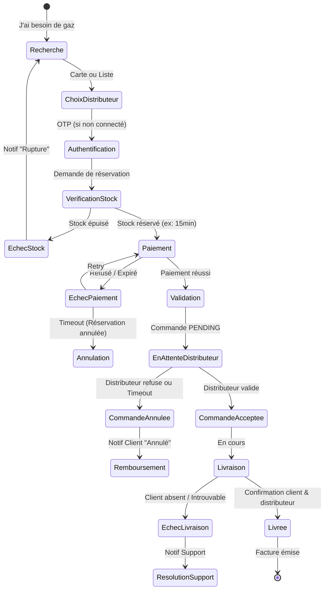
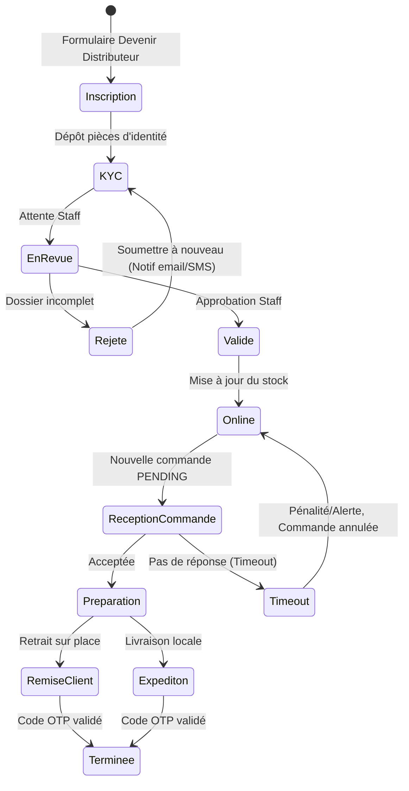
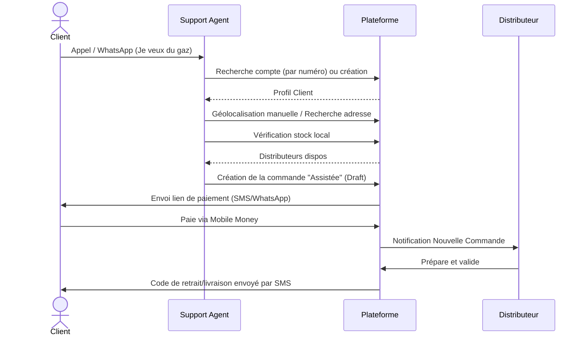

# Cadrage UX et Modèle RBAC

## 1. Sitemap et Accès

L'application repose sur un modèle d'authentification centralisé : un seul compte (numéro de téléphone) permettant d'accéder à différents profils via un sélecteur d'espace.

### 1.1 Portail Public (Visiteurs non connectés)
Ces pages sont accessibles librement. L'inscription (via OTP SMS/WhatsApp) n'est exigée qu'au moment de valider une action engageante (réserver, commander).
- **Home** : Présentation du service.
- **J'ai besoin de gaz** : Carte/liste des points de vente à proximité et recherche.
- **Devenir distributeur** : Formulaire de pré-inscription pour les commerçants.
- **Products & Services** : Vitrine (Données réelles À CONFIRMER).
- **About / FAQ / Blog / Contact** : Contenus informatifs existants.
- **Sécurité d'utilisation du gaz** : Bonnes pratiques et urgences (Contenu à fournir par PLEINGAZ).
- **Mentions légales, CGV, Confidentialité** : Pages légales obligatoires (Textes À CONFIRMER).

### 1.2 Espace Client (Authentification par OTP)
- **Tableau de bord** : Résumé des commandes en cours.
- **Mes Commandes** : Historique et factures.
- **Mon Profil & Adresses** : Gestion des informations personnelles et repères de livraison.

### 1.3 Espace Distributeur (Authentification par OTP)
- **Ma Boutique** : Horaires, localisation, statut d'ouverture.
- **Mes Stocks** : Mise à jour de l'état des stocks (BON/MOYEN/FAIBLE/RUPTURE).
- **Gestion des Commandes** : Réception, préparation et remise/livraison des commandes locales.
- **Mon Équipe** : Gestion des sous-comptes pour le personnel de la boutique.
- **Mes Finances** : Suivi des ventes, factures émises, et règlements (Settlement).

### 1.4 Control Center Admin (Staff PLEINGAZ)
*L'accès au staff exige obligatoirement Mot de passe + TOTP (Authenticator). L'OTP simple est interdit pour le staff.*
- **Vue Globale** : Statistiques, alertes de rupture, monitoring des paiements.
- **Gestion Distributeurs** : Validation des candidatures (KYC/Pièces), suspension.
- **Support & Commandes** : Saisie de commandes assistées, annulations d'urgence, remboursements.
- **Gestion des Rôles** : Affectation des permissions granulaires.

### 1.5 Navigation Mobile (Menu Hamburger ~6 entrées)
1. Trouver du gaz (Carte/Recherche)
2. Mes Commandes
3. Mon Profil
4. Devenir Distributeur
5. Sécurité & Urgences
6. Contact & Support

---

## 2. Parcours Utilisateurs (Diagrammes)

### 2.1 Parcours Client (Recherche et Commande)
Ce parcours inclut la gestion des échecs (stock épuisé, refus de paiement, échec de livraison).

### 2.2 Parcours Distributeur (Inscription et Opérations)
Gestion du dossier, y compris les rejets et l'expiration des commandes.

### 2.3 Parcours Commande Assistée (Téléphone/WhatsApp)
Le client contacte le support car il n'a pas internet ou n'arrive pas à commander.

---

## 3. Matrice des Rôles et Permissions (RBAC)

Le système n'utilise pas de rôles codés en dur dans la logique métier, mais vérifie des permissions granulaires affectées dynamiquement aux rôles.
**Règles de visibilité et d'audit :**
- Un distributeur/client ne voit que les ressources lui appartenant (suffixe `:own`).
- Le distributeur ne voit du client que le strict nécessaire pour la livraison (Nom, Téléphone masqué ou redirigé, Adresse, Repère).
- `document:view_identity` (pièces d'identité) est ultra-restreint et l'accès est tracé dans l'Audit Log.
- Actions sensibles (suspension, remboursement) génèrent une trace d'audit immuable.

### 3.1 Catalogue des Permissions Granulaires (Extrait)
| Domaine | Permission | Description |
|---|---|---|
| **User** | `user:view_own` / `user:view_any` | Voir son profil / tous les profils |
| **Store** | `store:update_stock` | Mettre à jour l'inventaire |
| **Store** | `store:manage_staff` | Gérer les sous-comptes de la boutique |
| **Order** | `order:create_own` / `order:process` | Créer une commande / Traiter une commande (distributeur) |
| **Order** | `order:create_any` | Créer une commande assistée pour un tiers (Support) |
| **Finance** | `invoice:view_own` / `invoice:view_any` | Consulter les factures |
| **Finance** | `payment:refund` | Émettre un remboursement (très sensible) |
| **Admin** | `distributor:approve` / `distributor:suspend`| Valider ou bannir un distributeur |
| **Admin** | `document:view_identity` | Voir les KYC (Action auditée avec justification) |
| **Admin** | `system:manage_roles` | Créer/Modifier les rôles et permissions |

### 3.2 Matrice Rôles × Permissions (Jeu MVP)

Les sous-comptes boutique permettent au propriétaire (Distributor) de déléguer la gestion du stock sans donner accès à ses revenus (`invoice:view_own`). Le chemin d'évolution prévoira d'autres rôles (Logistics, Finance) plus tard.

| Permission | CUSTOMER | DISTRIBUTOR (Staff) | DISTRIBUTOR (Owner) | SUPPORT_AGENT | DISTRIBUTOR_MANAGER | ADMIN | SUPER_ADMIN |
|---|:---:|:---:|:---:|:---:|:---:|:---:|:---:|
| `user:view_own` | ✅ | ✅ | ✅ | ✅ | ✅ | ✅ | ✅ |
| `store:update_stock`| ❌ | ✅ | ✅ | ❌ | ❌ | ❌ | ✅ |
| `store:manage_staff`| ❌ | ❌ | ✅ | ❌ | ❌ | ❌ | ✅ |
| `order:create_own` | ✅ | ❌ | ❌ | ❌ | ❌ | ❌ | ✅ |
| `order:process` | ❌ | ✅ | ✅ | ❌ | ❌ | ❌ | ✅ |
| `order:create_any` | ❌ | ❌ | ❌ | ✅ | ❌ | ✅ | ✅ |
| `invoice:view_own` | ✅ | ❌ | ✅ | ❌ | ❌ | ❌ | ✅ |
| `invoice:view_any` | ❌ | ❌ | ❌ | ❌ | ❌ | ✅ | ✅ |
| `document:view_identity`| ❌ | ❌ | ❌ | ❌ | ✅ | ✅ | ✅ |
| `distributor:approve`| ❌ | ❌ | ❌ | ❌ | ✅ | ✅ | ✅ |
| `payment:refund` | ❌ | ❌ | ❌ | ❌ | ❌ | ✅ | ✅ |
| `system:manage_roles`| ❌ | ❌ | ❌ | ❌ | ❌ | ❌ | ✅ |

*Note: L'unique différence entre ADMIN et SUPER_ADMIN est la capacité pour le Super Admin de modifier les rôles, les configurations globales et d'accéder aux logs système ineffaçables.*

---

## 4. Décisions à confirmer avec PLEINGAZ (Urgentes)

1. **Délais (Timeouts)** : Quel délai accorder à un distributeur pour accepter une commande (avant annulation) ? Quel délai de réservation de stock le client a-t-il pour payer ?
2. **Textes Légaux** : Les CGV, mentions légales, et la page "Sécurité d'utilisation du gaz" doivent être rédigés.
3. **Contacts** : Quels sont les numéros d'urgence et les horaires d'ouverture du support pour les commandes assistées ?
