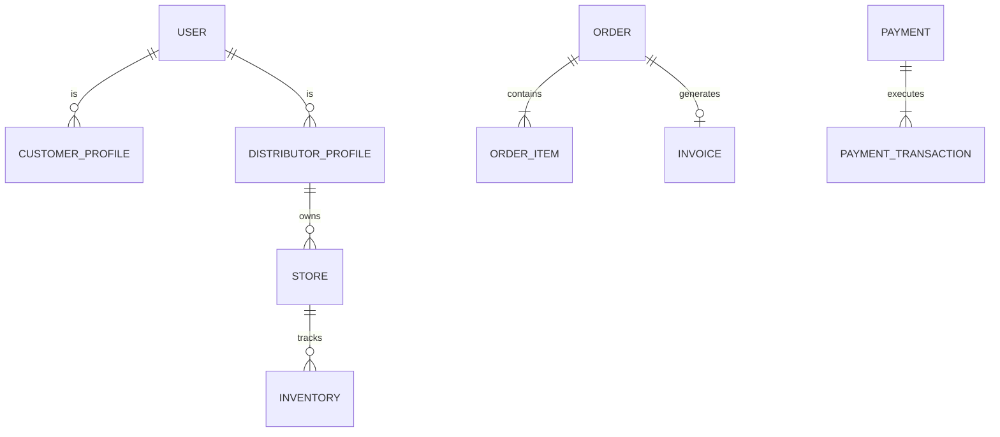
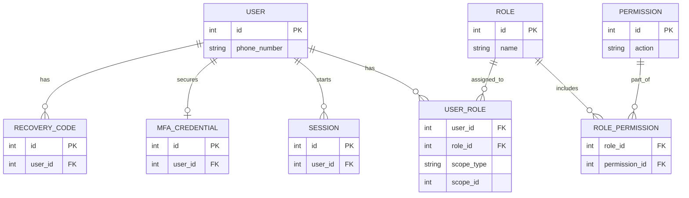
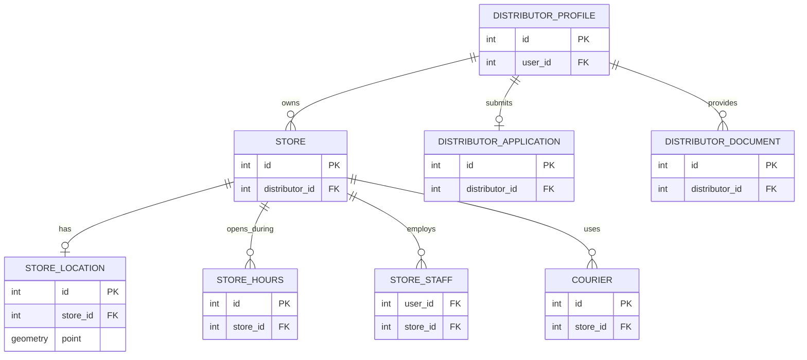
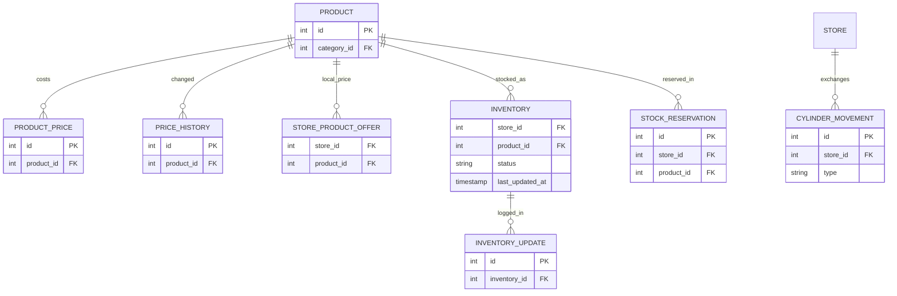
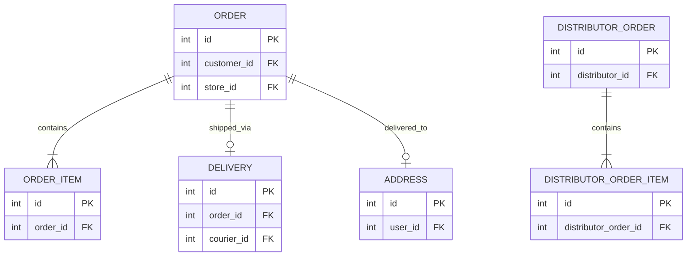
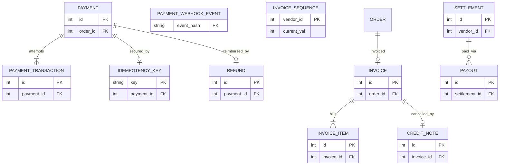
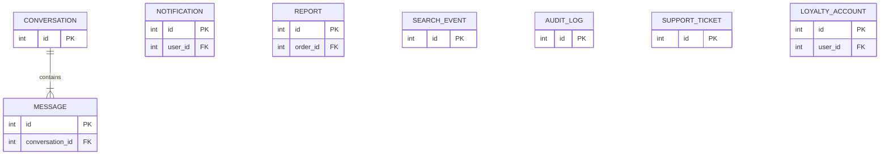

# Inventaire des Entités et ERD

Ce document dresse l'inventaire complet des entités du domaine et présente le modèle relationnel. Aucune donnée métier réelle de l'audit préliminaire n'est utilisée.

## 1. Inventaire Complet des Entités

| Domaine | Entité | Description | Clés / Relations | Données Sensibles |
|---|---|---|---|---|
| **Accès** | `User` | Compte utilisateur unique par téléphone | Clé: `id`, `phone_number` | Oui |
| **Accès** | `Role` | Rôle (ensemble de permissions) | Clé: `id` | Non |
| **Accès** | `Permission` | Permission granulaire | Clé: `id` | Non |
| **Accès** | `RolePermission` | Association Rôle-Permission | FK: `role_id`, `permission_id` | Non |
| **Accès** | `UserRole` | Rôle d'un utilisateur sur un scope (ex: une boutique) | FK: `user_id`, `role_id`, scope | Non |
| **Accès** | `CustomerProfile` | Profil d'un client | FK: `user_id` | Oui (Données pers.) |
| **Accès** | `DistributorProfile` | Profil d'un distributeur propriétaire | FK: `user_id` | Oui |
| **Accès** | `StaffProfile` | Profil d'un employé PLEINGAZ | FK: `user_id` | Oui |
| **Accès** | `Session` | Session de connexion | FK: `user_id` | Oui (Token) |
| **Accès** | `MfaCredential` | Identifiant TOTP (double facteur) | FK: `user_id` | Oui |
| **Accès** | `RecoveryCode` | Code de secours MFA | FK: `user_id` | Oui |
| **Réseau** | `DistributorApplication` | Dossier de candidature | FK: `distributor_id` | Oui |
| **Réseau** | `DistributorDocument` | Pièce justificative KYC (stockée de façon isolée) | FK: `distributor_id` | Oui (CNI, etc.) |
| **Réseau** | `Store` | Boutique physique (un distributeur peut en avoir 0..N) | FK: `distributor_id` | Non |
| **Réseau** | `StoreLocation` | Coordonnées géographiques de la boutique | FK: `store_id` | Non |
| **Réseau** | `StoreHours` | Horaires d'ouverture | FK: `store_id` | Non |
| **Réseau** | `StoreStaff` | Sous-compte pour le personnel de la boutique | FK: `store_id`, `user_id` | Oui |
| **Réseau** | `Courier` | Livreur rattaché à une boutique ou indépendant | FK: `store_id` | Oui |
| **Catalogue** | `ProductCategory` | Catégorie de produit (ex: 12.5kg) | Clé: `id` | Non |
| **Catalogue** | `Product` | Produit au catalogue global | FK: `category_id` | Non |
| **Catalogue** | `ProductPrice` | Tarification globale avec validité temporelle | FK: `product_id` | Non |
| **Catalogue** | `PriceHistory` | Historique audité des changements de prix | FK: `product_id` | Non |
| **Catalogue** | `StoreProductOffer` | Tarif spécifique si liberté tarifaire locale | FK: `store_id`, `product_id` | Non |
| **Stock** | `Inventory` | État qualitatif du stock (BON/MOYEN/FAIBLE/RUPTURE) | FK: `store_id`, `product_id` | Non |
| **Stock** | `InventoryUpdate` | Historique des changements de stock | FK: `inventory_id` | Non |
| **Stock** | `StockReservation` | Blocage temporaire d'une unité pour une commande | FK: `order_id`, `product_id`, `store_id` | Non |
| **Stock** | `CylinderMovement` | Tracabilité et gestion des consignes (Entrées/Sorties) | FK: `store_id`, `order_id` | Non |
| **Commande** | `Order` | Commande passée par un client | FK: `customer_id`, `store_id` | Oui |
| **Commande** | `OrderItem` | Ligne de la commande client | FK: `order_id`, `product_id` | Non |
| **Commande** | `DistributorOrder` | Commande passée par un distributeur à un grossiste | FK: `distributor_id` | Non |
| **Commande** | `DistributorOrderItem`| Ligne de la commande distributeur | FK: `distributor_order_id`, `product_id`| Non |
| **Commande** | `Delivery` | Processus logistique de livraison de la commande | FK: `order_id`, `courier_id` | Oui (GPS) |
| **Commande** | `Address` | Adresse et repère texte pour la livraison locale | FK: `user_id` | Oui |
| **Finance** | `Payment` | Tentative ou succès de règlement | FK: `order_id` | Oui |
| **Finance** | `PaymentTransaction` | Tracabilité technique et frais de l'opérateur (fee_bearer) | FK: `payment_id` | Oui |
| **Finance** | `IdempotencyKey` | Verrou contre les double-paiements | FK: `payment_id` | Non |
| **Finance** | `PaymentWebhookEvent` | Trace pour rejeu des hooks | Clé: `event_hash` | Non |
| **Finance** | `Invoice` | Facture globale de la commande | FK: `order_id`, `vendor_id` | Non |
| **Finance** | `InvoiceItem` | Ligne de la facture | FK: `invoice_id` | Non |
| **Finance** | `InvoiceSequence` | Compteur de numérotation séquentielle par vendeur | Clé: `vendor_id` | Non |
| **Finance** | `CreditNote` | Avoir d'annulation (Immuable) | FK: `invoice_id` | Non |
| **Finance** | `Refund` | Remboursement d'un paiement | FK: `payment_id` | Oui |
| **Finance** | `Settlement` | Processus de règlement des créances/dettes | FK: `vendor_id` | Non |
| **Finance** | `Payout` | Virement final de la plateforme au distributeur | FK: `settlement_id` | Non |
| **CRM** | `Conversation` | Fil de discussion (Support ou Distributeur/Client) | Clé: `id` | Oui |
| **CRM** | `Message` | Message dans une conversation | FK: `conversation_id` | Oui |
| **CRM** | `Notification` | Alerte utilisateur (App/Email/SMS) | FK: `user_id` | Oui |
| **CRM** | `NotificationPreference`| Préférences et opt-in de notification | FK: `user_id` | Non |
| **CRM** | `Review` | Avis laissé par le client | FK: `order_id`, `store_id` | Non |
| **CRM** | `Favorite` | Boutique ou produit favori | FK: `user_id` | Non |
| **CRM** | `SupportTicket` | Demande d'assistance | FK: `user_id` | Oui |
| **CRM** | `KnowledgeDocument` | Fiche d'aide (ex: sécurité gaz) | Clé: `id` | Non |
| **CRM** | `Report` | Signalement ou litige | FK: `reporter_id`, `order_id` | Oui |
| **Analytics**| `SearchEvent` | Historique des recherches utilisateurs (même à 0 résultat)| Clé: `id` | Oui |
| **Analytics**| `AuditLog` | Trace d'une action sensible | FK: `user_id` | Oui |
| **Analytics**| `StockAlert` | Alerte seuil de stock déclenchée | FK: `store_id`, `product_id` | Non |
| **Analytics**| `DemandAlert` | Alerte de rupture (demande insatisfaite) | FK: `store_id`, `product_id` | Non |
| **Analytics**| `Promotion` | Règle de réduction | Clé: `id` | Non |
| **Analytics**| `LoyaltyAccount` | Compte de points de fidélité | FK: `user_id` | Non |
| **Analytics**| `LoyaltyTransaction` | Gain ou dépense de points | FK: `loyalty_account_id` | Non |
| **Admin** | `Setting` | Paramètres applicatifs (délais, frais) | Clé: `key` | Non |

*Entités écartées : Aucune entité requise n'a été écartée. Toutes les suggestions et impératifs (notamment les tables de lock, d'idempotence et les traces métiers) ont été intégrées.*

---

## 2. Diagrammes d'Entité-Relation (ERD)

### 2.1 ERD Global Simplifié

### 2.2 ERD 1 : Utilisateurs, Accès et Profils

### 2.3 ERD 2 : Réseau et Distributeurs

### 2.4 ERD 3 : Catalogue et Stock

### 2.5 ERD 4 : Commandes et Livraison

### 2.6 ERD 5 : Paiements, Factures et Reversements

### 2.7 ERD 6 : Communication, IA et Analytics

