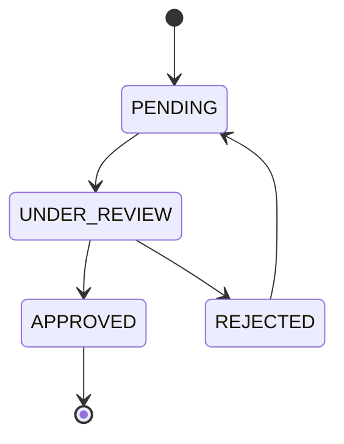
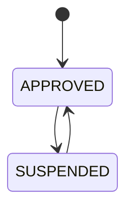
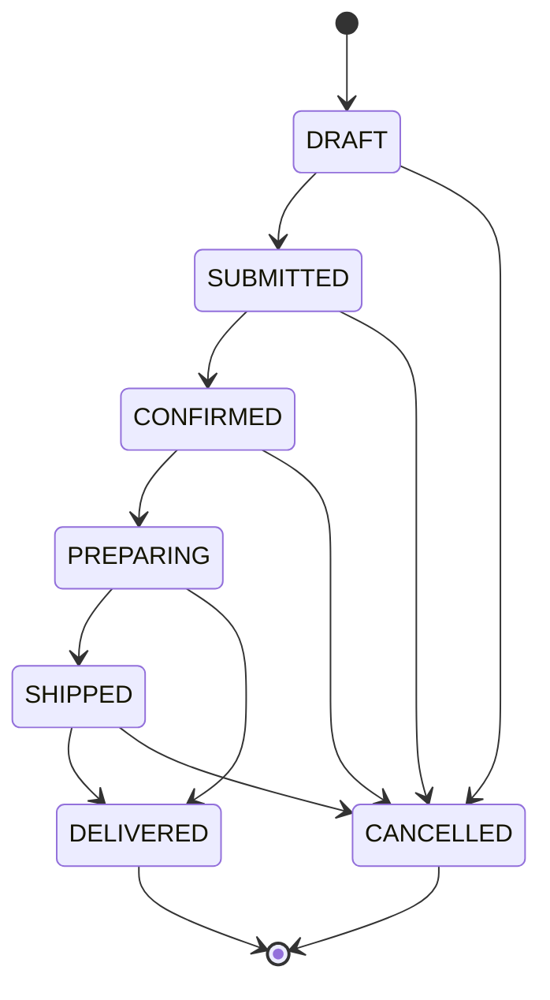
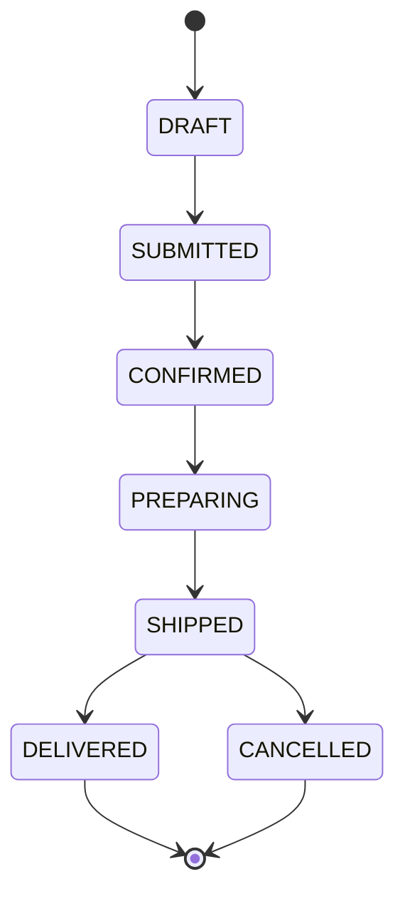
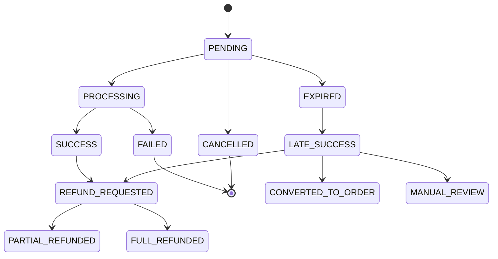
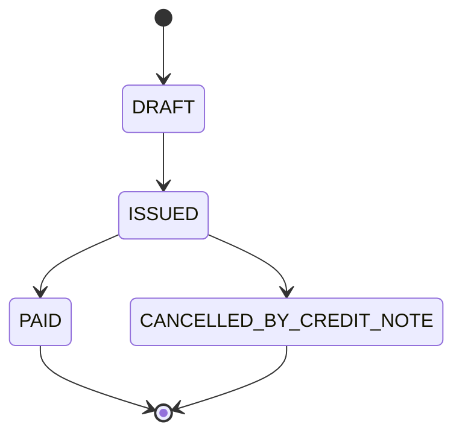
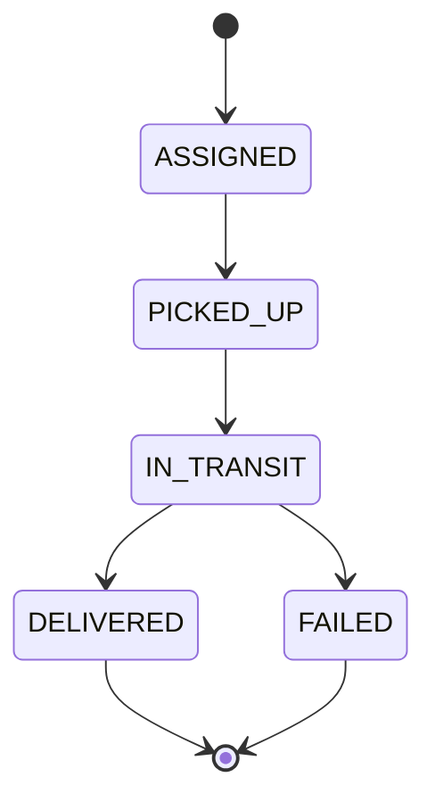
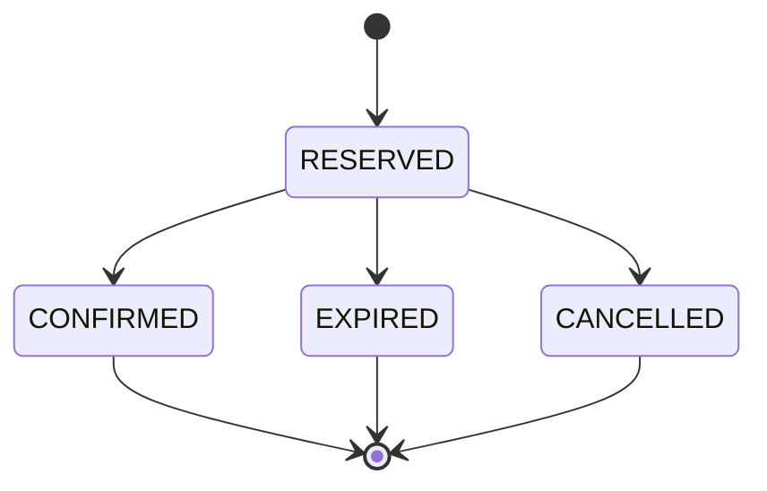
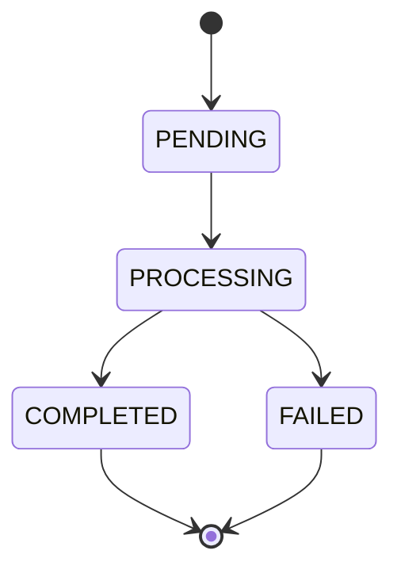

# Machines à États

## 1. DistributorApplication (Dossier de candidature)

- **Autorisées** :
  - `PENDING` -> `UNDER_REVIEW` (Staff prend en charge, AuditLog OUI).
  - `UNDER_REVIEW` -> `APPROVED` (Staff valide KYC, AuditLog OUI).
  - `UNDER_REVIEW` -> `REJECTED` (Staff refuse avec motif, AuditLog OUI).
  - `REJECTED` -> `PENDING` (Distributeur resoumet, AuditLog OUI).
- **Interdites** : Passer directement de `PENDING` à `APPROVED` ; Revenir de `APPROVED` à `PENDING`.

## 2. Cycle de vie Distributeur (DistributorProfile)

- **Autorisées** :
  - `APPROVED` -> `SUSPENDED` (Admin bannit, AuditLog OUI, motif obligatoire).
  - `SUSPENDED` -> `APPROVED` (Admin réactive, AuditLog OUI).
- **Interdites** : Supprimer le profil si des commandes existent.

## 3. Order (Commande Client)

- **Autorisées** :
  - `DRAFT` -> `SUBMITTED` (Client valide, AuditLog NON).
  - `SUBMITTED` -> `CONFIRMED` (Distributeur accepte, AuditLog OUI).
  - `CONFIRMED` -> `PREPARING` (Distributeur prépare, AuditLog NON).
  - `PREPARING` -> `SHIPPED` (Remis au livreur, AuditLog NON).
  - `SHIPPED` -> `DELIVERED` (Code de remise fourni, AuditLog OUI).
- **Interdites** : Passer de `DRAFT` à `CONFIRMED` ; Revenir de `DELIVERED` à `DRAFT`.

## 4. DistributorOrder (Commande du distributeur vers grossiste)

- **Autorisées** : `DRAFT` -> `SUBMITTED` (Distributeur soumet) -> `CONFIRMED` (Fournisseur accepte).
- **Interdites** : Mêmes règles que `Order`.

## 5. Payment

- **Autorisées** :
  - `PENDING` -> `EXPIRED` (Timeout du gateway).
  - `EXPIRED` -> `LATE_SUCCESS` (Paiement réussi APRÈS annulation commande).
  - `LATE_SUCCESS` -> `REFUND_REQUESTED` (Comportement automatique par défaut, initie un remboursement).
  - `LATE_SUCCESS` -> `CONVERTED_TO_ORDER` (Si stock dispo et client confirme).
  - `LATE_SUCCESS` -> `MANUAL_REVIEW` (En cas d'échec du remboursement auto).
- **Gestion du Late Success** : Si un webhook annonce un succès sur un paiement `EXPIRED` ou lié à une commande `CANCELLED`, le paiement passe en `LATE_SUCCESS`. 
  - **Défaut** : Le système déclenche automatiquement un remboursement total vers le moyen de paiement d'origine, notifiant le client. 
  - **Exception** : Le support peut convertir ce paiement en une nouvelle commande si le client accepte et que le stock est disponible. 
  - *(Note : L'option d'un "Wallet interne" pour stocker ce crédit est hors MVP et À CONFIRMER car elle implique un avis juridique strict sur la valeur stockée).*
- **Interdites** : L'utilisateur ne déclenche JAMAIS le passage à `SUCCESS` ; relancer un `FAILED` est interdit (nouveau Payment).

## 6. Invoice

- **Autorisées** :
  - `DRAFT` -> `ISSUED` (Facture générée et immuable, AuditLog NON).
  - `ISSUED` -> `PAID` (Paiement confirmé).
  - `ISSUED` -> `CANCELLED_BY_CREDIT_NOTE` (Génère un Avoir, AuditLog OUI).
- **Interdites** : Modifier une facture `ISSUED` ; Supprimer une facture.

## 7. Delivery

- **Autorisées** : Standard process logistique.
- **Interdites** : Passer de `ASSIGNED` à `DELIVERED` sans transit.

## 8. StockReservation

- **Autorisées** : `RESERVED` -> `EXPIRED` (Cron job ou timeout de 15m/30m).
- **Interdites** : Modifier les quantités pendant `RESERVED` ; Réactiver une réservation `EXPIRED`.

## 9. Settlement / Payout

- **Autorisées** : Batch nocturne traite `PENDING` -> `COMPLETED`.
- **Interdites** : Recréer un règlement `COMPLETED`.

## 10. Refund

- **Autorisées** : `PROCESSING` -> `COMPLETED` (Webhook acquéreur).
- **Interdites** : Lancer un `Refund` si solde Payment insuffisant.
