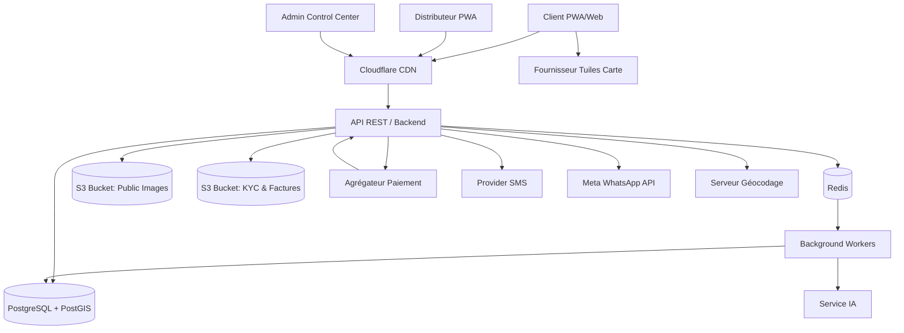
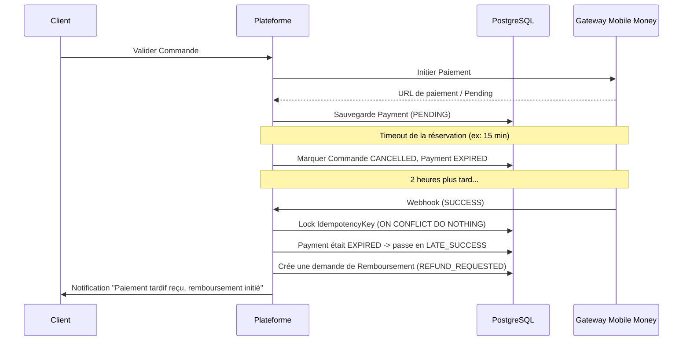
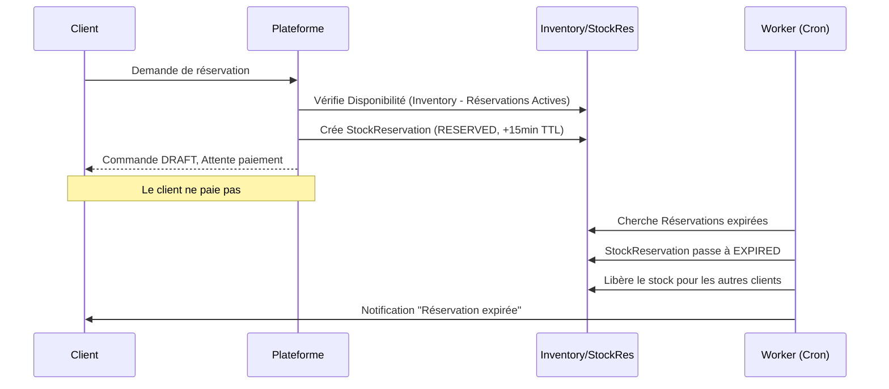
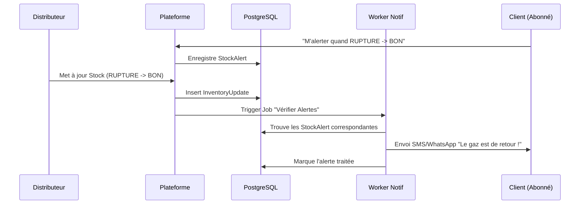
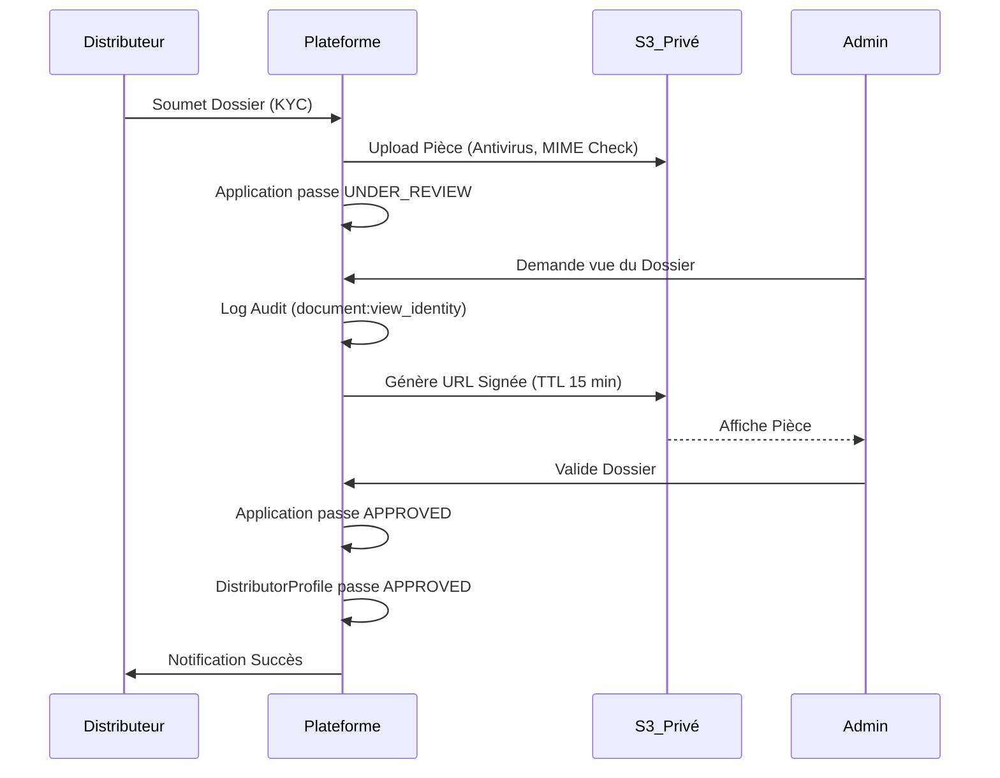

# Architecture Technique

## 1. Diagramme d'Architecture Globale

## 2. Hébergement et CDN (ADR D2)
**Statut de l'ADR D2 : PROPOSÉ.**
La plateforme doit équilibrer les coûts et la performance depuis le Cameroun.
- **Option A : Hébergement local/régional (ex: Afrique du Sud)**. Latence très faible (50-80ms). Coût élevé, facturation en USD souvent premium, support variable, conformité forte des données locales.
- **Option B : VPS Européen + Cloudflare (Recommandé)**. Latence moyenne (120-150ms) pour les requêtes API, mais statiques servis ultra-rapidement via le cache edge de Cloudflare. Coût faible/moyen, support robuste.
- **Paramétrage Cloudflare** : Anti-bot configuré pour ne pas bloquer les vrais utilisateurs/API. Origine verrouillée sur le trafic CDN. IP réelle via `True-Client-IP`.

## 3. Stratégie de Cache (TTL et Durée de cache)
Il est critique de séparer les contenus statiques des contenus dynamiques (stock, données privées).
- **Statiques (CSS, JS, Fonts)** : Durée de cache longue (1 an) avec invalidation par hash de fichier.
- **Images publiques** : Durée de cache de 30 jours au niveau du CDN.
- **Pages Vitrines (SSR Next.js)** : Pré-rendues avec ISR (Incremental Static Regeneration). Durée de cache/TTL de 1 heure.
- **Blocs Dynamiques (ex: Stock d'un point de vente)** : Le squelette de la page du distributeur est en cache, mais **le bloc affichant le stock est toujours chargé dynamiquement (Client-Side Fetch)** et porte un TTL de 0 seconde (pas de cache). Il affiche systématiquement la "date de dernière mise à jour".
- **Données Sensibles (Factures, Profils)** : En-têtes HTTP `Cache-Control: no-store, no-cache, max-age=0`.
- **Redis** : Utilisé pour les caches temporaires (TTL courts, ex: 5 min pour une recherche sans géolocalisation), le rate limiting et le TTL des OTP (ex: 5 minutes).

## 4. API REST et Recherche
- **Standards** : `/api/v1`, OpenAPI (Swagger) généré depuis le code, erreurs standardisées (RFC 7807), CORS restrictif. Politique de dépréciation sur 6 mois.
- **Rate Limiting** : Limites par endpoint via Redis (ex: `POST /otp` limité à 3/heure ; `POST /orders` limité à 5/heure ; `GET /search` limité à 30/minute).
- **Recherche** : Dans un premier temps, recherche PostgreSQL (extensions `pg_trgm`, `unaccent`, gestion des synonymes de quartiers). La bascule vers OpenSearch ne sera envisagée que si la recherche textuelle dépasse 500ms sur des millions de requêtes ou nécessite des filtres à facettes très complexes.

## 5. Stockage S3 et Fichiers
- **S3 Public** : Logos, photos des boutiques.
- **S3 Privé (Isolé)** : Pièces d'identité (KYC) et Factures PDF.
- **Sécurité S3 Privé** : Accès backend exclusif, génération d'**URL signées** (TTL de 15 minutes) pour l'affichage ponctuel, vérification du type MIME, limitation de taille (ex: 5Mo), analyse antivirus à l'upload, et journalisation stricte des accès (`document:view_identity`).

## 6. Frontend, PWA et Gestion de la Faible Connexion
- **Architecture** : Next.js. Séparation en 3 portails (Public/Client, Distributeur, Admin).
- **Offline / PWA (Mode faible connexion)** : 
  - Service Workers pour le cache des assets vitaux.
  - Sauvegarde locale d'une commande interrompue pour reprise automatique.
  - Affichage explicite des états hors-ligne ("*Vous êtes hors ligne, données potentiellement anciennes*").
  - **Mise à jour de stock Distributeur hors ligne** : Le distributeur modifie son stock sans réseau. L'action va dans une file locale (IndexedDB). À la reconnexion, la mise à jour part vers l'API avec **l'horodatage réel** de la déclaration. La résolution des conflits côté backend priorise toujours l'heure de la déclaration locale face aux déductions automatiques.

## 7. Cartographie, Géocodage et Tuiles (ADR D3)
**Statut de l'ADR D3 : PROPOSÉ.**
- **Géocodage** : Le distributeur cible son adresse à l'inscription. Nominatim utilisé en backend via file d'attente (1 req/sec, User-Agent identifié, cache base de données). Interface `GeocodingProvider` pour changer de fournisseur. Source de vérité = Marqueur validé manuellement + repère texte. Pas d'autocomplétion à la frappe.
- **Tuiles de la carte** : Le serveur public OSM est interdit pour ce trafic. Il faut basculer sur un fournisseur commercial adapté (Mapbox, JawgMaps) ou auto-héberger.
- **Liste de secours** : Si la carte ne charge pas (échec réseau ou timeout fournisseur), une liste textuelle ordonnée par distance s'affiche obligatoirement.

## 8. Tâches en Arrière-plan (Workers)
Gestion des processus asynchrones via files d'attente (ex: BullMQ sur Redis).
- **Files** : Notifications, PDF generation, Webhooks de paiement, Expiration des réservations, Alertes de stock.
- **Résilience** : Reprises (retries) exponentielles, idempotence, file des échecs (Dead Letter Queue) et déclenchement d'alertes Slack/Email pour les admins.

## 9. Budgets de Performance (Contrôlés en CI)
Mesures ciblées pour les connexions bridées (Slow 3G/4G Cameroun).
- **Poids de la page initiale** : < 300 Ko (gzippé/brotli).
- **Nombre de requêtes initiales** : < 20 requêtes.
- **Taille de la carte (Tuiles)** : Limité aux tuiles visibles uniquement, chargement paresseux.
- **LCP cible** : < 2.5 secondes.

## 10. Diagrammes de Séquence (Processus Critiques)

### 10.1 Paiement Webhook, Expiration et LATE_SUCCESS

### 10.2 Commande, Réservation de Stock et Expiration

### 10.3 Mise à jour Stock et Notification de Retour en Stock

### 10.4 Validation d'un Dossier Distributeur

---

## 11. Décisions Urgentes à Confirmer (Ajoutées à OPEN_QUESTIONS.md)
1. **Hébergement et Devises** : Le VPS européen (ADR D2) implique des factures en Euro/USD. L'entreprise PLEINGAZ peut-elle régler ces frais internationaux ?
2. **Confidentialité et CDN** : L'utilisation de Cloudflare (US) doit être validée juridiquement et inscrite dans les mentions légales.
3. **Fournisseur de Tuiles (Budget)** : Valider l'enveloppe budgétaire pour JawgMaps, Mapbox ou un auto-hébergement de tuiles OSM.
4. **Environnements Cloud** : Accord sur la séparation des coûts pour financer une vraie Pré-production identique à la Prod.
