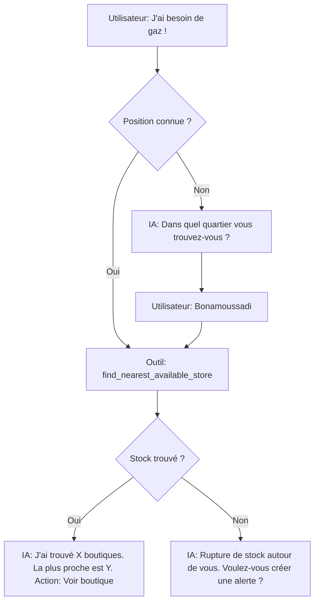
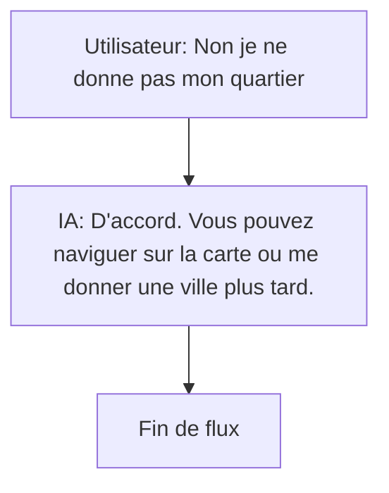
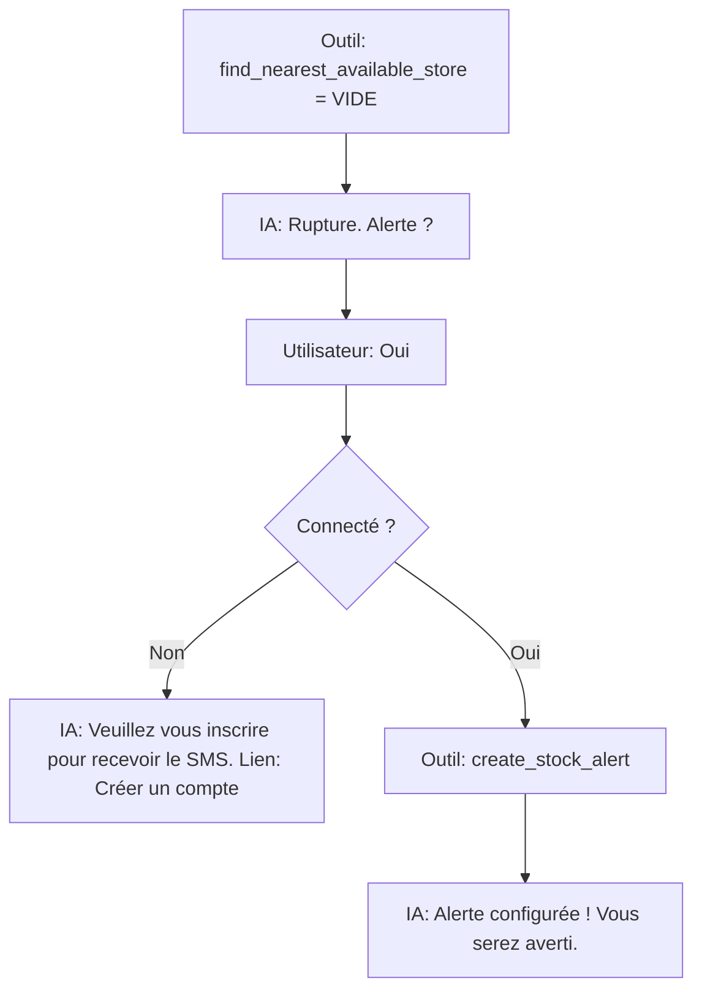
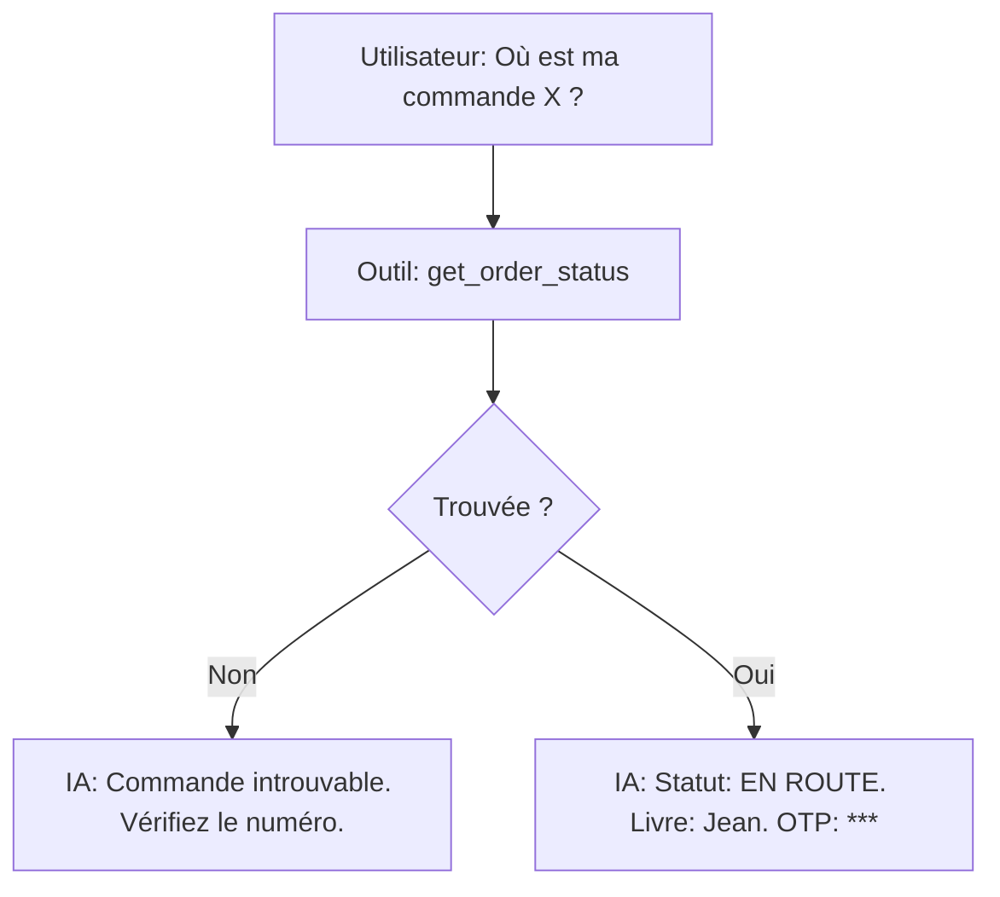
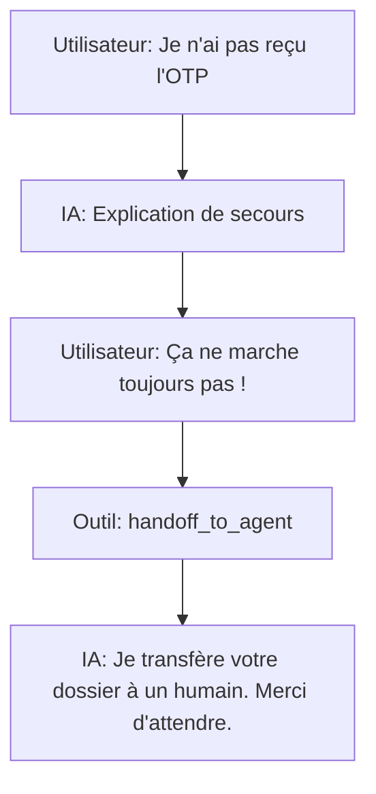

# Parcours Conversationnels Types de l'Assistant

## 1. Recherche de bout en bout ("J'ai besoin de gaz")

## 2. Refus de Localisation

## 3. Rupture puis Alerte

## 4. Commande jusqu'au suivi

## 5. Transfert vers un Conseiller (Escalade)

